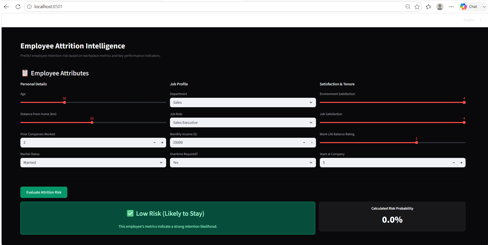
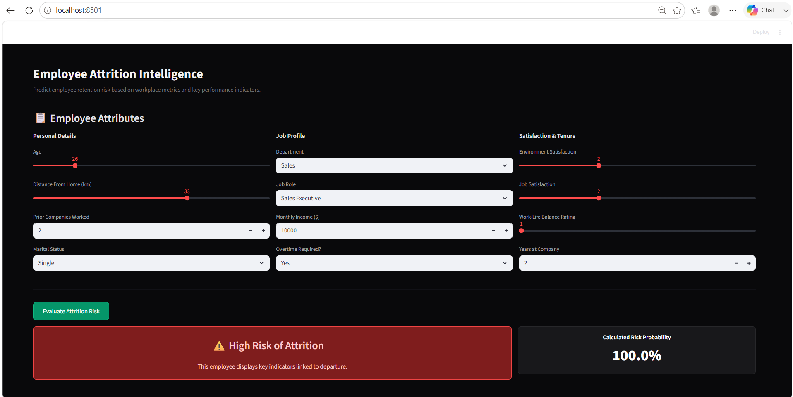

Markdown
# 💼 Employee Attrition Intelligence


An end-to-end Machine Learning project and interactive web dashboard designed to predict employee turnover risk. By analyzing workplace metrics, demographic data, and job satisfaction indicators, this tool provides HR professionals with actionable insights to proactively improve employee retention.

---

## ✨ Key Features

* **Real-time Predictions:** Instantly evaluate attrition risk using a sleek, modern UI.
* **Smart Feature Alignment:** The backend automatically maps minimal UI inputs to a complex 35-feature baseline, ensuring robust model calculations.
* **Data Scaling:** Integrates a pre-trained `StandardScaler` to ensure UI inputs match the exact mathematical distributions the model learned during training.
* **Probability Scoring:** Doesn't just provide a binary "Yes/No" but calculates a precise risk percentage.
* **Dark Mode Native:** Beautiful Obsidian & Emerald color palette built on Streamlit.

---

## 📸 Dashboard Previews

### Low Risk Assessment (Likely to Stay)
> The model identifies strong retention metrics and calculates a low probability of departure.


### High Risk Assessment (Flight Risk)
> The model flags warning signs (e.g., high distance from home, low job satisfaction, excessive overtime) and triggers a warning badge.


---

## 📂 Project Structure

```text
EMPLOYEE-ATTRITION-PREDICTION/
│
├── Datasets/
│   ├── train.csv                # Training dataset (Historical HR data)
│   └── test.csv                 # Testing dataset for evaluation
│
├── images/                      # Dashboard screenshots for documentation
│   ├── high-risk-prediction.png
│   └── low-risk-prediction.png
│
├── app.py                       # The Streamlit web application frontend
├── Employee_Attrition_Prediction.ipynb # Jupyter Notebook (EDA, Data Prep, Model Training)
├── model.pkl                    # Serialized Machine Learning model (e.g., Random Forest/Logistic Regression)
├── scaler.pkl                   # Serialized StandardScaler for data normalization
└── README.md                    # Project documentation
⚙️ Installation & Usage
1. Clone the Repository
Bash
git clone [https://github.com/Sachi0124/employee-attrition-prediction.git](https://github.com/Sachi0124/employee-attrition-prediction.git)
cd employee-attrition-prediction
2. Install Dependencies
Ensure you have Python installed, then install the required libraries:

Bash
pip install streamlit pandas numpy scikit-learn
3. Run the Application
Launch the Streamlit server locally:

Bash
streamlit run app.py
The dashboard will automatically open in your default web browser at http://localhost:8501.

🧠 Under the Hood
The Machine Learning Pipeline
Exploratory Data Analysis (EDA): Identified key drivers of attrition, such as OverTime, MonthlyIncome, and JobSatisfaction.

Preprocessing: Handled missing values, applied One-Hot Encoding to categorical variables, and standardized numerical features using StandardScaler.

Model Training: Trained multiple classifiers (Logistic Regression, Random Forest, SVM) in Employee_Attrition_Prediction.ipynb to identify the best-performing algorithm.

Artifact Export: Saved the final tuned model as model.pkl and the scaler as scaler.pkl to prevent data leakage and ensure production consistency.

The UI Baseline Logic
Because the final model was trained on 35 distinct features, but the UI only requests 9 key inputs to remain user-friendly, app.py constructs a "baseline employee" profile in the background. It dynamically injects the user's UI inputs into this baseline, standardizes the entire array, and feeds it to the model for highly accurate, real-time probability scoring.

🚀 Future Enhancements
Add a visual "Feature Importance" chart to show why the model made its decision.

Implement a database (SQLite/PostgreSQL) to log historical predictions.

Add batch-prediction capabilities (upload a .csv of an entire department).

Built by Sachith C — Feel free to connect or contribute!
